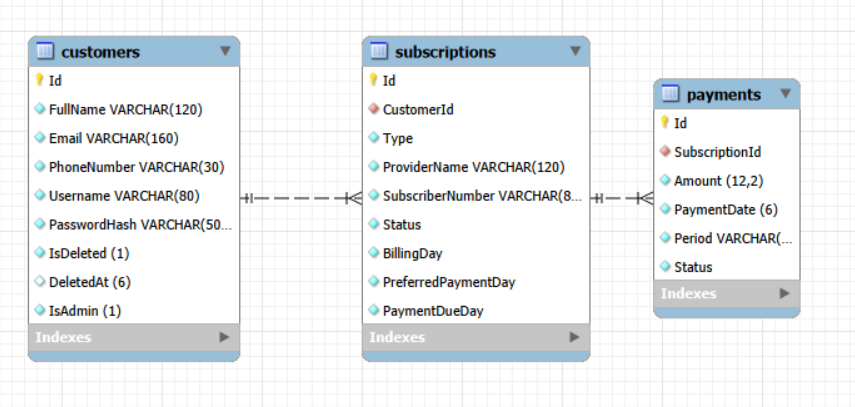
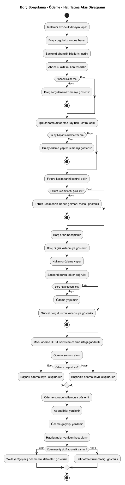

# Abonelik ve Otomatik Ödeme Hatırlatma

Sade bir banka abonelik takip uygulaması. Müşteri girişi, profil görüntüleme, abonelik, borç sorgulama, ödeme ve hatırlatma kontrollerini içerir.

## Teknolojiler

- Backend: .NET 8 Web API
- Frontend: HTML, CSS, vanilla JavaScript
- Veritabanı: MySQL
- ORM: Entity Framework Core + Pomelo MySQL provider

## Proje Yapısı

```text
Backend/
  Controllers/
  Data/
  Models/
  Services/
Frontend/
  assets/
    favicon.svg
  index.html
  style.css
  app.js
docs/
  images/
    archi_yazilim_er.png
    archi_yazilim_flow.png
global.json
ArchitectCase.sln
```

## Kurulum

MySQL'de veritabanı oluşturun:

```sql
CREATE DATABASE subscription_reminder_db;
```

İsterseniz tablolar için doğrudan `database.sql` dosyasını çalıştırabilirsiniz.

`Backend/appsettings.json` içindeki connection string'i kendi MySQL kullanıcınıza göre güncelleyin:

```json
"DefaultConnection": "server=localhost;port=3306;database=subscription_reminder_db;user=root;password=your_password"
```

Alternatif olarak EF migration oluşturup veritabanını güncelleyin:

```powershell
dotnet tool install --global dotnet-ef
dotnet ef migrations add InitialCreate --project Backend
dotnet ef database update --project Backend
```

Backend'i çalıştırın:

```powershell
dotnet run --project Backend
```

Frontend `Frontend/` klasöründedir ve backend tarafından statik dosya olarak servis edilir. Backend çalışırken tarayıcıda şu adresi açın:

```text
http://localhost:5041
```

Swagger:

```text
http://localhost:5041/swagger
```

## API Özeti

- `GET /api/customers`
- `POST /api/customers/register`
- `POST /api/customers/login`
- `GET /api/customers/{id}`
- `DELETE /api/customers/{id}` soft delete ile hesabı pasife alır
- `GET /api/subscriptions`
- `POST /api/subscriptions`
- `PUT /api/subscriptions/{id}`
- `DELETE /api/subscriptions/{id}`
- `GET /api/debts/subscription/{subscriptionId}`
- `GET /api/payments`
- `POST /api/payments`
- `GET /api/payments/subscription/{subscriptionId}`
- `GET /api/payments/customer/{customerId}`
- `GET /api/reminders/customer/{customerId}`
- `POST /api/reminders/customer/{customerId}/send-sms` ödeme gününden bir gün önce mock SMS hatırlatması döndürür
- `GET /api/test-date`
- `POST /api/test-date` admin kullanıcının test tarihini ayarlamasını sağlar
- `DELETE /api/test-date` admin kullanıcının test tarihini gerçek tarihe döndürmesini sağlar
- `DELETE /api/admin/customers/{id}/hard-delete` admin kullanıcının müşteriyi cascade olarak kalıcı silmesini sağlar

## Admin Modu

- Admin kullanıcı normal müşteri akışlarını kullanabilir; abonelik ekleyebilir, borç sorgulayabilir ve ödeme yapabilir.
- Admin ek kontrolleri sadece `IsAdmin = true` olan kullanıcı giriş yaptığında ana ekranda görünür.
- Admin yapmak için mevcut bir kullanıcı kaydına veritabanında `IsAdmin = TRUE` verilebilir.
- Admin yetkili isteklerde frontend `X-Admin-User-Id` header'ını gönderir.
- Test tarihi yönetimi ana ekrandaki admin kontrollerinden yapılır.
- Normal müşteri silme işlemi soft delete yapar ve kayıt geçmişini korur.
- Admin hard delete işlemi müşteriyi, aboneliklerini ve ödeme kayıtlarını fiziksel olarak siler.

```sql
UPDATE Customers
SET IsAdmin = TRUE
WHERE Username = 'admin_kullanici_adi';
```

## Mock Servisler

- `DebtService`: Abonelik bilgilerine göre dönemsel borç üretir.
- `MockPaymentService`: Ödeme sonucunu mock olarak başarılı veya başarısız döndürür.
- `ReminderService`: Aktif ve bu ay ödenmemiş abonelikleri listeler.

## AI Kullanımı

Bu projenin geliştirme sürecinde yapay zekadan kod üretimi, hata ayıklama ve proje yapısını düzenleme konularında destek alınmıştır. Backend API uçlarının oluşturulması, frontend ekranlarının geliştirilmesi, statik dosya servis yapısının düzenlenmesi, ödeme/borç/hatırlatma akışlarının kodlanması ve hata senaryolarının analiz edilmesi AI desteğiyle gerçekleştirilmiştir.

Proje adım adım geliştirilirken genel işleyiş, gereksinimlerin yorumlanması, senaryoların doğrulanması ve manuel testler tarafımdan yapılmıştır. Müşteri girişi, abonelik oluşturma, borç sorgulama, ödeme yapma, bildirim/SMS hatırlatma akışları ve admin işlemleri uygulama üzerinden manuel olarak test edilmiştir. AI çıktıları doğrudan kabul edilmeden önce proje ihtiyaçlarına göre kontrol edilmiş, çalışan senaryolara göre düzenlenmiş ve son kararlar geliştirici tarafından verilmiştir.

## Diyagramlar

### ER Diyagramı



### Borç Sorgulama - Ödeme - Hatırlatma Akışı


